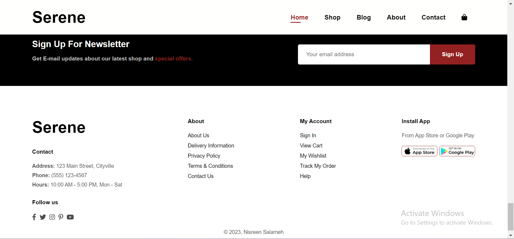

# eCommerceWebsite-Serene
Serene is an elegantly designed e-commerce website where fashion meets technology. Using HTML, CSS, Flex box, and JavaScript, I've crafted a responsive experience that seamlessly adapts to desktop, iPad, and iPhone X.




## Features

- Responsive design that adapts to various screen sizes.
- Navigation menu with links to different sections of the website.
- Featured products section showcasing a curated collection of products.
- Promotional banners for special offers and collections.
- Newsletter sign up form for staying updated with the latest news and offers.
- Social media icons for easy sharing and following.

## Technologies Used
- HTML5
- CSS3
- JavaScript
- Font Awesome (for icons)


## Usage
1. Clone this repository to your local machine using:
```
git clone https://github.com/NisreenSalameh/eCommerceWebsite-Serene
```
2. Open the index.html file in your preferred web browser to explore the captivating landing page.
3. Enjoy the visually appealing design, smooth scrolling effects, and engaging content.

> [!NOTE]
> Feel free to customize and adapt this landing page template to fit your specific project or branding needs.


This site was built using [GitHub Pages](https://pages.github.com/).

Explore the ArtisticAlchemy Landing Page: [https://nisreensalameh.github.io/eCommerceWebsite-Serene/](https://nisreensalameh.github.io/eCommerceWebsite-Serene/)


## Contributors
- Nisreen Salameh - Developer and Designer
